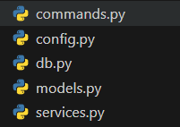

# Документация менеджера заметок

Программа для создания и хранения заметок в базе данных.

Небольшая программа, так что я попытался использовать минимальное количество строк с красивой архитектурой и модульностью. 

## Используемые инструменты:
- python
- Tortoise orm (SQLite)
- Утилиты для работы с командной строкой(pick, colorama)

## Чем хороша моя архитиктура?

Смысл моей архитектуры в том, что я как конструктор лего могу собирать и пересобирать любые команды откуда угодно. Можно вызвать любую команду из любой команды и она без проблем перейдет туда. Используя рекурсию, то есть вызывая функцию команды в этой же функции команды, можно просто обновлять команду бесконечно. Это полезно, например для удаления, где после удаления необходимо сразу переходить в список заметок, которые можно удалить.

Полезные функции, которые повторяются многократно, но не относятся непосредственно к командам из меню, я перенес в модуль services.py

ORM позволяет строить модели и любые запросы к базе данных. Всю ее мощь можно заметить при нескольких моделях. Оставим это для расширения проекта.

Программа очень расширяема, как конструктор лего, как я говорил выше. Благодаря модульности можно без проблем добавить новые команды или увеличить количество фич, добавив функции в модуль services.

Соблюдены стандарты языка программирования, PEP8, комментирование кода, тайпинги, , благодаря ORM невозможно сделать sql-инъекции, код читабельный и интуитивно понятный.

## Описание архитектуры

#### Программа начинается с точки входа:

В ней инициализируется ORM Tortoise, а также запускается сама командная строка

#### Основные модули

- commands:
    - сборник всех команд
- config: 
    - здесь хранится вся конфигурация
- models: 
    - сбоник моделей
- services: 
    - сборник всех полезных утилит

В самих файлах все предельно четко и ясно задокументировано

## Заключение

Надеюсь я получу профи :) Здесь не получилось показать ООП, порождающие паттерны программирования или какой-нибудь MVC, так как приложение довольно маленькое и тупо просто так усложнять проект всякими ООП, когда здесь с головой хватит процедурного стиля с 5-6 функциями-командами. 